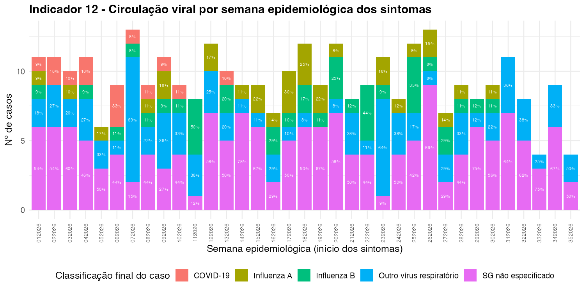
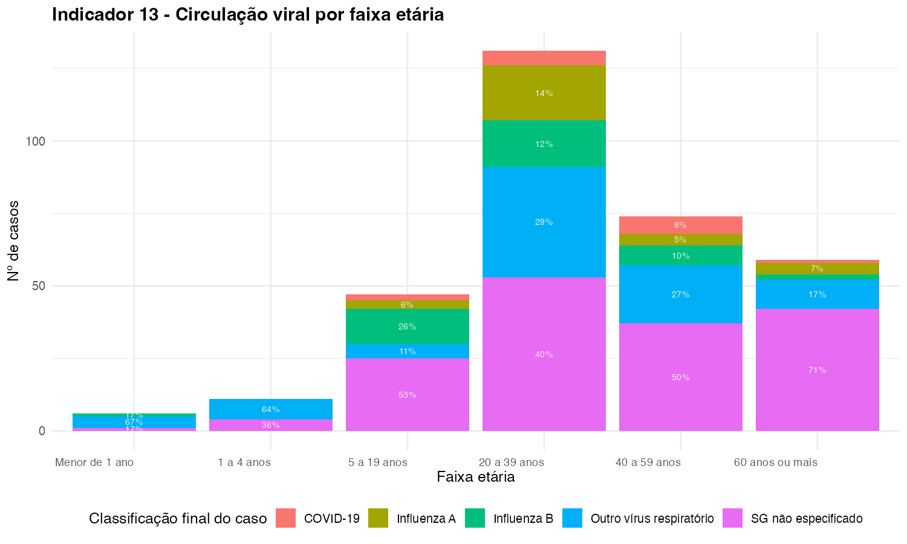
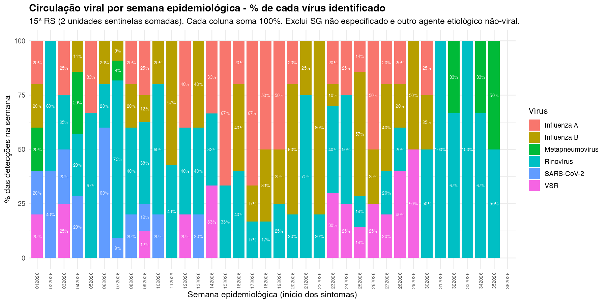
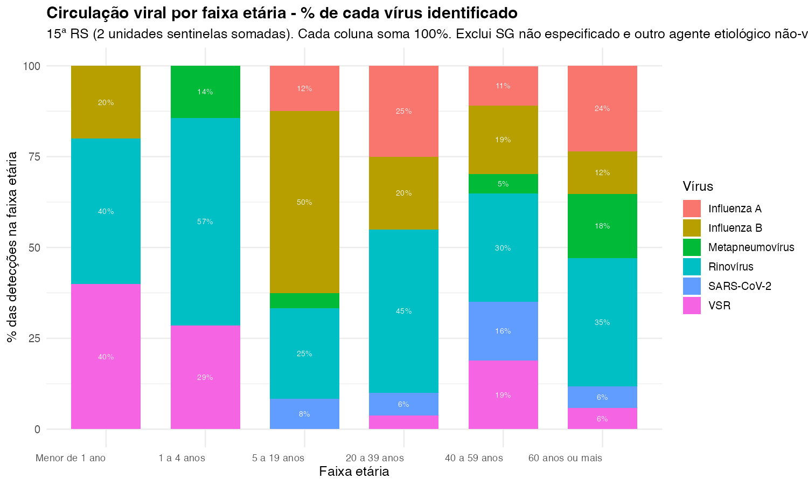

Esta página traz a distribuição dos vírus respiratórios circulantes, em duas versões: a classificação oficial dos Indicadores 12 e 13 da NT9 (que inclui casos ainda não identificados), e uma versão complementar só com os vírus efetivamente encontrados, útil para acompanhar a variação semanal sem a categoria "SG não especificado" dominando a leitura.

**Meta esperada:** não se aplica — indicadores descritivos de vigilância, não de desempenho.

## Indicador 12 — por semana (oficial)

Classificação final do caso (`CLASSI_FIN`), incluindo "SG não especificado".

## Indicador 13 — por faixa etária (oficial)

## Só vírus identificados — por semana

Abre a categoria "Outro vírus respiratório" nos vírus específicos (VSR, Parainfluenza, Adenovírus, Metapneumovírus, Bocavírus, Rinovírus), usando os campos de RT-PCR e Imunofluorescência da ficha. Exclui "SG não especificado" e "outro agente etiológico" (não necessariamente viral). Um caso pode aparecer em mais de um vírus se houver codetecção.

## Só vírus identificados — por faixa etária

