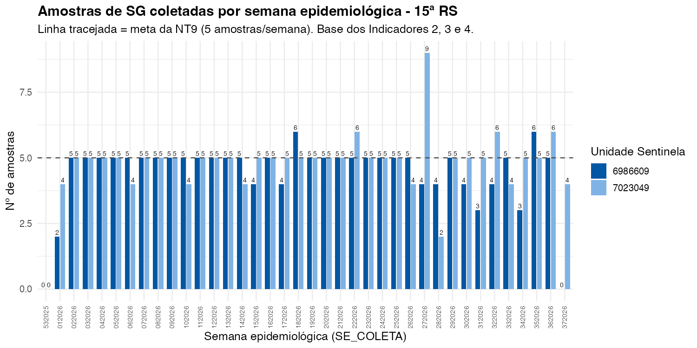
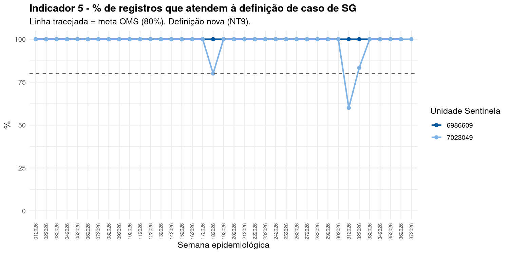
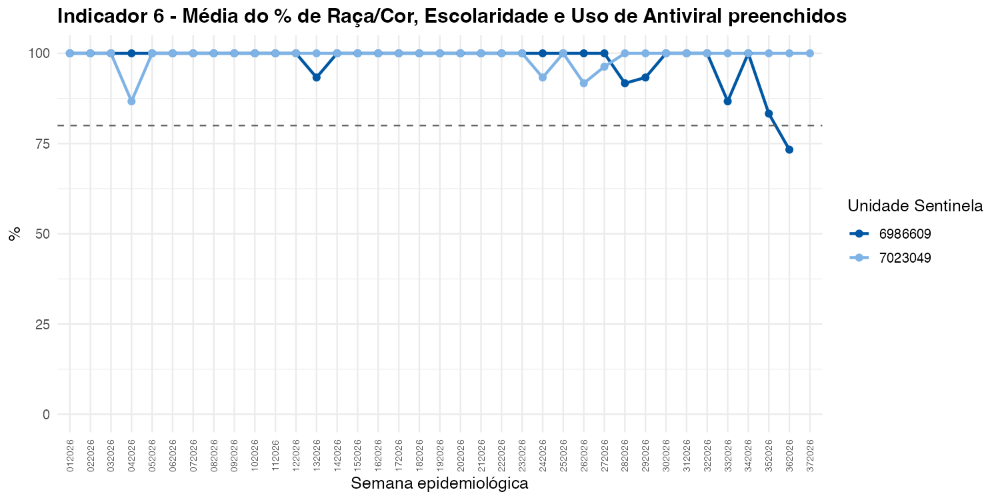
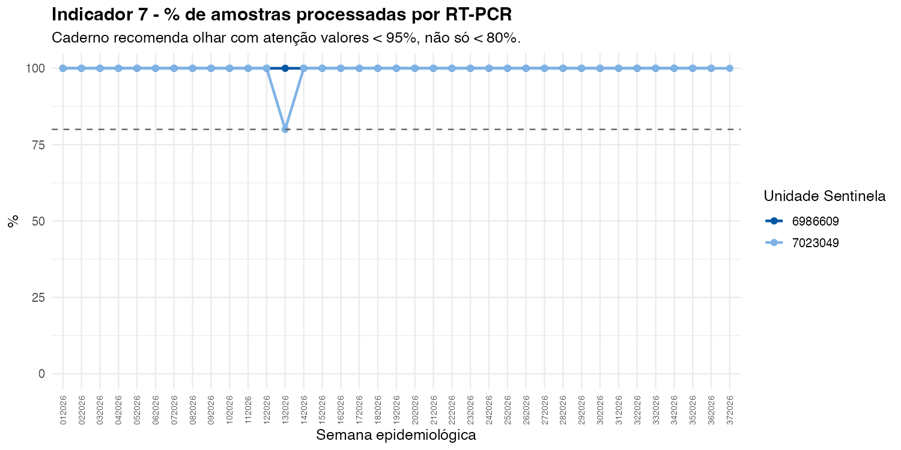
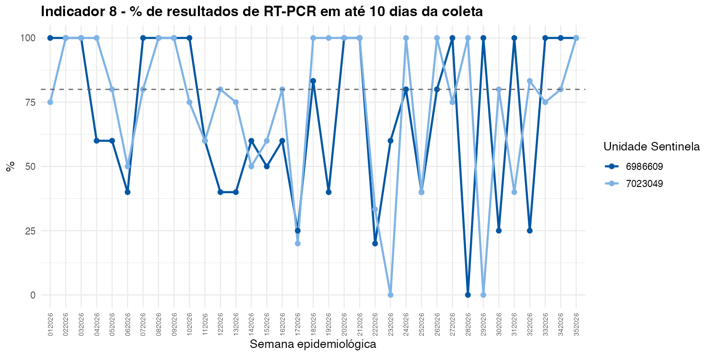
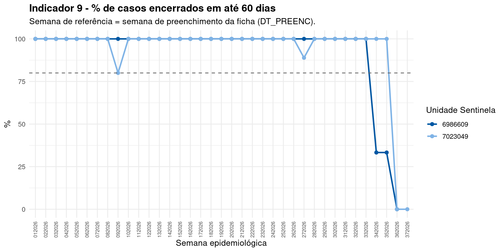
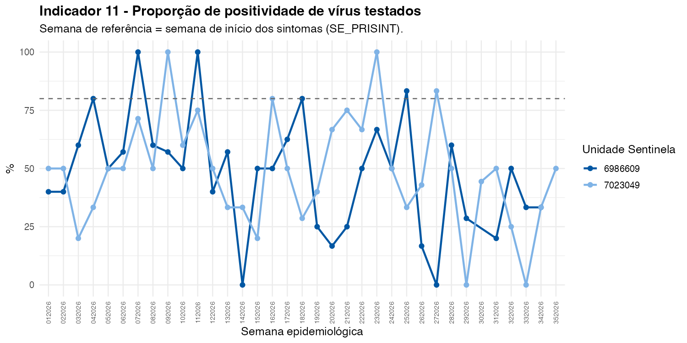
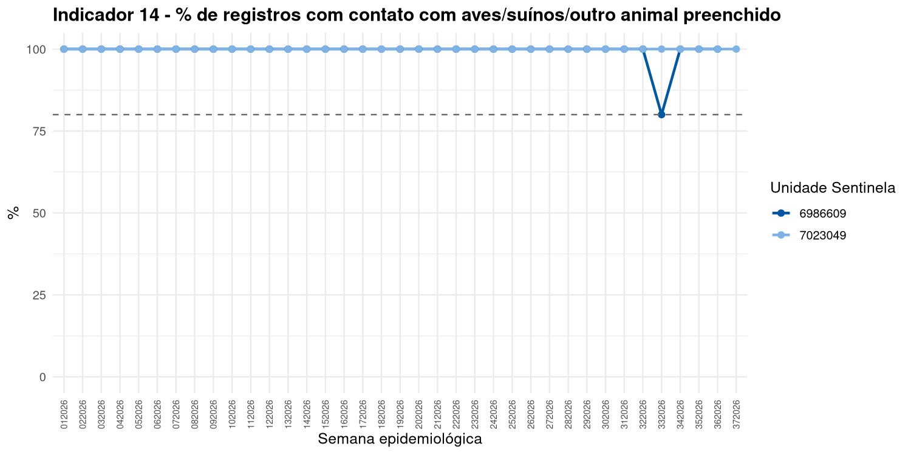

```{r}
#| label: setup
library(dplyr)
library(readr)
library(gt)

ler_indicador <- function(arquivo) {
  caminho <- file.path("dados", arquivo)
  if (!file.exists(caminho)) return(NULL)
  readr::read_csv2(caminho, show_col_types = FALSE)
}

# Troca o código CNES pelo nome da unidade sentinela, nas tabelas.
# [Inferência] Nomes conforme a Tabela 1 da NT9 (RS 15 - Maringá/Sarandi).
nomes_unidades <- c(
  "6986609" = "UPA Zona Sul (Maringá)",
  "7023049" = "UPA Sarandi (Sarandi)"
)

renomear_unidade <- function(df) {
  if ("COD_UNID" %in% names(df)) {
    codigo <- as.character(df$COD_UNID)
    df$COD_UNID <- ifelse(codigo %in% names(nomes_unidades),
                           nomes_unidades[codigo], codigo)
  }
  df
}

# Troca os nomes técnicos de coluna (os mesmos usados no script R) pelo
# termo que a fórmula do indicador usa (ex.: "Nº de SE" em vez de
# "se_periodo"), para ler sem precisar saber o código. Colunas não
# listadas aqui mantêm o nome original.
rotulos_colunas <- c(
  COD_UNID                    = "Unidade sentinela",
  se_com_coleta                = "Nº de SE com coleta de amostras",
  se_periodo                   = "Nº de SE no período",
  indicador_2_pct                = "Indicador 2 (%)",
  classificacao                   = "Classificação",
  total_amostras                   = "Total de amostras coletadas",
  indicador_3_media                 = "Média de amostras por SE",
  se_dentro_4a20                     = "Nº de SE com 4 a 20 amostras",
  pct_se_4a20                         = "% de SE com 4 a 20 amostras",
  indicador_4_pct                      = "Indicador 4 (%)",
  total_registros                       = "Total de registros",
  atende_definicao                       = "Registros que atendem à definição de caso",
  indicador_5_pct                         = "Indicador 5 (%)",
  pct_raca                                 = "% Raça/Cor preenchida",
  pct_escolaridade                          = "% Escolaridade preenchida",
  pct_antiviral                              = "% Uso de antiviral preenchido",
  indicador_6_media                           = "Indicador 6 (%)",
  amostras_enviadas                            = "Amostras enviadas",
  processadas_pcr                               = "Processadas por RT-PCR",
  indicador_7_pct                                = "Indicador 7 (%)",
  alerta_desperdicio_amostra                      = "Alerta de desperdício (< 95%)",
  total_processadas                                = "Total processadas",
  ate_10_dias                                       = "Resultado em até 10 dias",
  indicador_8_pct                                    = "Indicador 8 (%)",
  encerrados_60d                                      = "Encerrados em até 60 dias",
  indicador_9_pct                                      = "Indicador 9 (%)",
  total_testados                                        = "Total testados",
  positivos                                              = "Positivos",
  indicador_11_pct                                        = "Indicador 11 (%)",
  preenchidos                                              = "Campo preenchido",
  indicador_14_pct                                          = "Indicador 14 (%)"
)

renomear_colunas <- function(df) {
  atuais <- names(df)
  names(df) <- ifelse(atuais %in% names(rotulos_colunas), rotulos_colunas[atuais], atuais)
  df
}

# Cores no padrão farol (verde/amarelo/vermelho), igual ao já usado nas
# apresentações da 15ª RS - aplicado por igualdade de texto, não por
# posição, então funciona independente da ordem das linhas.
cores_classificacao <- list(
  "Meta Atingida"          = "#2e7d32",  # verde
  "Dentro do recomendado"  = "#2e7d32",  # verde
  "Baixo Desempenho"       = "#f9a825",  # amarelo
  "Baixíssimo Desempenho"  = "#ef6c00",  # laranja
  "Silencioso"             = "#c62828",  # vermelho
  "Abaixo do recomendado"  = "#ef6c00",  # laranja
  "Acima do recomendado"   = "#1565c0"   # azul (não é falha, é excesso)
)

tabela_indicador <- function(df, titulo = NULL) {
  if (is.null(df)) {
    return(gt::gt(data.frame(Aviso = "Dado ainda não gerado - rode o script de indicadores.")))
  }

  df <- renomear_unidade(df)
  df <- renomear_colunas(df)

  tabela <- gt::gt(df) |>
    gt::tab_header(title = titulo) |>
    gt::opt_row_striping() |>
    gt::cols_align(align = "center") |>
    gt::tab_options(
      table.font.size = "14px",
      column_labels.background.color = "#0057A3",
      column_labels.font.weight = "bold",
      table.border.top.color = "#0057A3",
      table.border.bottom.color = "#0057A3"
    )

  if ("Unidade sentinela" %in% names(df)) {
    tabela <- tabela |> gt::cols_align(align = "left", columns = "Unidade sentinela")
  }

  if ("Classificação" %in% names(df)) {
    for (valor in unique(df[["Classificação"]])) {
      cor <- cores_classificacao[[valor]]
      if (!is.null(cor)) {
        tabela <- tabela |>
          gt::tab_style(
            style = list(gt::cell_fill(color = cor), gt::cell_text(color = "white", weight = "bold")),
            locations = gt::cells_body(columns = "Classificação", rows = df[["Classificação"]] == valor)
          )
      }
    }
  }

  tabela
}
```

A classificação de desempenho segue as faixas do Caderno de Análise: **Silencioso** (0%) · **Baixíssimo Desempenho** (1-20%) · **Baixo Desempenho** (21-80%) · **Meta Atingida** (81-100%) — exceto onde indicado de outra forma.

::: {.aviso-dado}
Os Indicadores **1** e **10** não aparecem aqui: dependem da Ficha de Agregado Semanal do Sivep-Gripe (total de atendimentos gerais), que não está nesta base de dados individual. Consulte o relatório pronto do próprio SIVEP-Gripe (menu Relatórios > Indicadores) para esses dois.
:::

## Indicador 2 — % de semanas com coleta de amostras

**Meta esperada:** ≥ 80% (Meta Atingida).

Base comum aos Indicadores 2, 3 e 4: nº de amostras de SG coletadas por semana epidemiológica, por unidade sentinela.



```{r}
tabela_indicador(ler_indicador("indicador_02.csv"))
```

## Indicador 3 — Média de amostras coletadas por semana

**Meta esperada:** 5 amostras/semana (meta específica da NT9/PR — Tabela 2, "Excelente"). Não é percentual, então não usa a classificação padrão acima; a classificação nacional do Caderno de Análise (Silencioso · Abaixo do recomendado 1-3 · Dentro do recomendado 4-20 · Acima do recomendado 21+) é mais frouxa que a meta do Paraná.

```{r}
tabela_indicador(ler_indicador("indicador_03.csv"))
```

## Indicador 4 — Homogeneidade de envio de amostras

**Meta esperada:** ≥ 80% (Meta Atingida). Calculado como a média entre o Indicador 2 e o % de semanas com 4 a 20 amostras.

```{r}
tabela_indicador(ler_indicador("indicador_04.csv"))
```

## Indicador 5 — % de registros que atendem à definição de caso de SG

**Meta esperada:** ≥ 80% (Meta Atingida). Definição vigente da NT9: infecção respiratória, início ≤10 dias, ≥2 sintomas com ≥1 respiratório.



## Indicador 6 — Preenchimento de Raça/Cor, Escolaridade e Uso de Antiviral

**Meta esperada:** ≥ 80% (Meta Atingida). Média do % de preenchimento das 3 variáveis.



## Indicador 7 — % de amostras processadas por RT-PCR

**Meta esperada:** ≥ 80% (Meta Atingida) — mas o Caderno de Análise alerta que valores abaixo de 95% já indicam desperdício de amostra, um critério mais rígido que a meta genérica.



## Indicador 8 — % de resultados de RT-PCR em até 10 dias da coleta

**Meta esperada:** ≥ 80% (Meta Atingida).



## Indicador 9 — % de casos encerrados em até 60 dias

**Meta esperada:** ≥ 80% (Meta Atingida).

::: {.aviso-dado}
As últimas ~8-9 semanas deste gráfico tendem a cair de forma artificial: um caso notificado perto do fim do período analisado ainda não teve tempo de completar os 60 dias, então conta como "não encerrado" mesmo que a unidade feche o caso normalmente depois (censura à direita). Ao ler este gráfico, desconsidere a queda nas semanas mais recentes.
:::



## Indicador 11 — Proporção de positividade dos vírus testados

**Meta esperada:** não há meta definida na NT9 — é um indicador de resultado/vigilância (descreve a circulação viral), não de desempenho da unidade.



## Indicadores 12 e 13 — Circulação viral

**Meta esperada:** não se aplica — indicadores descritivos.

Circulação viral por semana epidemiológica e por faixa etária. Ver a página **[Circulação viral](circulacao-viral.qmd)** para os gráficos completos, incluindo a versão só com vírus efetivamente identificados (sem "SG não especificado").

## Indicador 14 — Preenchimento do contato com aves/suínos/outro animal

**Meta esperada:** ≥ 80% (Meta Atingida). Único indicador com fórmula e classificação totalmente descritas na própria NT9 (Anexo 1).



```{r}
tabela_indicador(ler_indicador("indicador_14.csv"))
```
